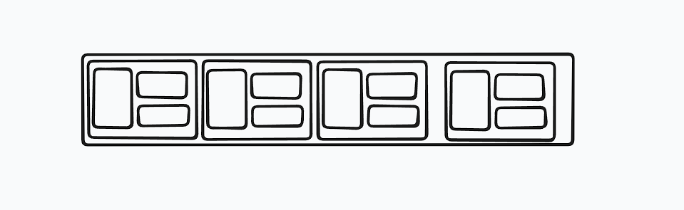

# Caça ao lanche diferente

Esse projeto foi desenvolvido por Filipe Santos Lima.

## Mecânica escolhida e Tema

Escolhi a mecânica: escolha o diferente, com o tema de comida usando emoji.

## Briefing do cliente

O público-alvo escolhido foi pessoa com daltonismo. Busquei fazer um design onde o jogo não dependesse de cores para ser jogado. Apesar de ainda conter partes coloridas que possam causar desconforto, a mecânica principal do projeto (encontrar o elemento diferente) pode ser feita através das formas dos emojis.

Além disso, enquanto implementava coloquei o jogo todo em escala de cinza para verificar contrastes e se era possível executar todo o fluxo do jogo sem as cores.

## Regras do jogo

O jogador deve inserir um nome (máximo 12 caracteres) e clicar em Jogar Agora

Um grid com emojis iguais e apenas um diferente é gerado

O jogador deve clicar no emoji diferente:

Se acertar: ganha 100 pontos, o tempo é registrado, avança para a próxima rodada e o temporizador é reiniciado. A cada acerto é feita uma verificação do tempo gasto, para atualizar o melhor tempo do jogador

Se errar: perde 50 pontos, perde 1 vida, e continua na rodada ate o tempo acabar

Se o tempo acabar: perde 50 pontos, perde 1 vida e um novo grid da mesma rodada é gerado

O jogo acaba quando o jogador perde todas as vidas (3) ou vence todas as rodadas (10)

No final é exibida a pontuação, o nome do jogador, as rodadas vencidas, o melhor tempo e as vidas restantes (vazio se forem zero)

## Minhas Decisões

### Tamanho e formato do grid

Escolhi usar grids quadrados de 5x5, 6x6 e 7x7. O tamanho aumenta conforme as rodadas avançam para deixar o jogo mais difícil aos poucos

### Quantidade de cores/elementos

Usei emojis como elementos principais, que são mais fáceis de distinguir sem depender da cor, mas também podem ser complicados de perceber diferenças em suas formas. Seguindo a lógica do jogo, coloquei 2 emojis parecidos por rodada, com as rodadas finais ficando mais difíceis

### Fórmula de pontuação

A pontuação funciona assim:

- Acerto: +100 pontos
- Erro: -50 pontos
- Tempo esgotado: -50 pontos

Meu único critério foi que o jogador não ficasse "negativo" com apenas um erro, seguindo a logica 1/2, ou seja, o jogador precisa ser penalizado 2 vezes para ficar sem a pontuação de uma rodada.

### Critérios de tempo

Cada rodada tem 10 segundos. Escolhi esse tempo para colocar uma "pressão" no jogador, já que são poucos cards.

### Curva de dificuldade

A dificuldade aumenta pelo tamanho do grid e pela semelhança dos emojis nas rodadas finais. Nas rodadas 4 e 7 o tamanho do grid aumenta, respectivamente, para 6x6 e 7x7.

### Condição de término

O jogo termina quando o jogador passa as 10 rodadas ou perde todas as 3 vidas. Escolhi usar vidas para o jogador ter mais de uma chance, em vez de perder no primeiro erro.

## Diferencial

Eu escolhi criar uma dificuldade progressiva:

- o tamanho do grid aumenta conforme a rodada
- emojis diferentes a cada rodada (ainda com ordem fixa)

E mecânicas simples de contagem regressiva e recorde de tempo.

## Como jogar

1. Digite seu nome
2. Clique em Jogar Agora ou aperte Enter
3. Encontre o emoji diferente no grid
4. Tente acertar antes do tempo acabar
5. Evite errar para não perder vidas e pontos
6. Tente vencer as 10 rodadas

## Como executar

Para executar o projeto:

1. Baixe ou clone o repositório
2. Abra a pasta do projeto
3. Abra o arquivo `index.html` no navegador

Ou clique no link ao lado para o acessar o site.

## Reflexão obrigatória

### 1. Qual foi o bug mais chato e como resolveu?

O bug mais chato que eu encontrei foi com o temporizador. O tempo começava a cair muito mais rápido do que deveria quando o contador chegava a 0 ou quando a rodada avançava. No começo ele diminuía normal, de 1 em 1 segundo, mas depois de algumas rodadas parecia que estava caindo de 2 em 2 ou até mais rápido. Então coloquei alguns “console.log” dentro do “setInterval” e percebi que ele estava sendo executado várias vezes, mesmo depois da rodada ter acabado. Para resolver, criei uma função só para iniciar o tempo e outra só para parar. Assim, antes de começar um novo cronômetro, eu cancelo o anterior com “clearInterval”. Também parei o tempo quando o jogador acerta o card, quando os segundos chegam a zero ou quando o jogo termina. Esse bug me ajudou a aprender que o “setInterval” continua rodando em segundo plano até ele ser parado.

Outra coisa, não foi bug, mas eu não estava conseguindo fazer a estrutura do cabeçalho com informações na tela do jogo, então desenhei um esboço (imagem abaixo) de como queria que ficasse e pedi para uma IA montar a estrutura HTML junto com o CSS, então adaptei para o meu projeto.

### 2. Por que escolheu essa fórmula de pontuação?

Escolhi +100 pontos no acerto e -50 pontos no erro porque queria que o acerto valesse mais que a penalidade. Assim, o jogador é recompensado por acertar, mas ainda perde pontos se errar ou deixar o tempo acabar.

### 3. Como o briefing do cliente mudou suas decisões?

Como o público-alvo que eu escolhi foram pessoas com daltonismo, tentei montar o jogo de um jeito em que a vitória não dependesse apenas de diferenciar cores. Por isso, decidi usar emojis de comida e bebida com formatos bem variados. Assim, mesmo quando dois emojis têm cores muito parecidas, o jogador ainda consegue identificar qual é o diferente observando o formato do lanche ou da bebida.

### 4. Se tivesse mais uma semana, o que mudaria?

Se eu tivesse mais uma semana de prazo, a primeira coisa que eu faria seria colocar um sistema de ranking, mesmo que fosse só uma tabela visual na tela final. Assim, o jogador poderia ver sua pontuação e comparar com outras tentativas. Também queria criar um “modo difícil”, com o cronômetro correndo mais rápido ou com menos tempo por rodada, para deixar o jogo mais competitivo. Além disso, eu usaria esse tempo extra para fazer uma revisão geral no código. No meio da correria para entregar no prazo, algumas coisas podem ter ficado para trás como comentários mal escritos ou criando funções que depois poderiam ser organizadas de um jeito mais simples.

### 5. Aponte uma função sua que ficou boa e explique o que ela faz

Pra mim, a função criarCard() atendeu os requisitos de “função boa”. Ela serve para criar os botões que contêm os emojis do grid e adicionar o evento de click neles. A funcao recebe os parâmetros de índice do grid, a posição que terá o emoji diferente e o objeto de emojis que devem ser usados.

A logica da função segue o seguinte:

-Cria os botões no html;  
-Verifica se o índice do grid é igual a posição que o emote diferente deve ser colocado: se sim, coloca o emoji diferente; se não, coloca o emote padrão.  
-Adiciona a classe css ao botões para serem estilizados no outro arquivo.  
-Adiciona a verificação ao clicar no botão.  
-O botão é retornado.

## Declaraçao de uso de IA

Durante a implementaçao do projeto, usei a IA como um "parceiro de equipe" para me ajudar a debater a ideia geral do jogo, auxiliar em referências de design, como no esboço do cabeçalho, e tirar dúvidas pontuais. A IA foi usada estritamente como suporte para estudo, organização e adaptação de ideias. Todas as decisões finais de mecânica, regras, pontuação, tema, público-alvo, implementação da lógica e ajustes do código foram feitas por mim.

## Creditos

Usei o vídeo JavaScript Dynamic Grid Lesson 4 Free Online Course JavaScript DOM para entender a lógica de criação de um grid dinâmico com JavaScript:

https://www.youtube.com/watch?v=C71QYag21fY

Também usei estes vídeos como apoio para entender melhor a manipulação de elementos na tela, a criação dos cards e o uso do método replaceChildren:

https://www.youtube.com/watch?v=EQUo5_PjHhg&t=337s

https://www.youtube.com/watch?v=1z9WKUszdN8

Para consultar métodos do JavaScript, como appendChild, replaceChildren, classList, eventos e o contador com setInterval e clearInterval, usei a documentação da W3Schools e da MDN e um vídeo:

https://www.w3schools.com/js/

https://developer.mozilla.org/pt-BR/docs/Web/JavaScript

https://www.youtube.com/watch?v=eN3ZZR-vns4

Para escolher e consultar os emojis usados no projeto usei o EmojiDB e o Emojipedia:

https://emojidb.org/

https://emojipedia.org/pt

## Licença

Este projeto está licenciado sob a licença MIT.
